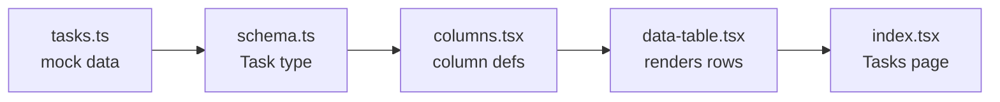

# Map format (`02-map.md`)

The map is for a developer who has never seen this codebase. It must be
**true, small, and checkable**.

## Evidence rules (non-negotiable)
- Every node is a real file path you actually opened.
- Every arrow is backed by a real `import`, prop, function call, or route
  reference. Cite it as `path:line` in the Evidence table.
- If you are not sure a link exists, leave it out. Never guess.
- Include ONLY files the ticket touches or that directly feed them
  (usually 4–10 nodes). Do not map the whole app.

## File structure

````
# Map — <ticket title>

## How it works (plain words)
3–6 sentences: where the data comes from, how it reaches the screen, and
where the ticket's change belongs. Explain any library concept the
developer may not know (e.g. "TanStack Table column definitions are...")
in one sentence each.

## Flow


## Evidence
| From | To | Proof (path:line) |
|---|---|---|
| tasks.ts | schema.ts | src/.../tasks.ts:3 `import { Task }` |

## Where the ticket lands
- `path` — why this file must change
````

(The flowchart above is only an example of the shape; build yours from the
real files.)

## After changes (Step 5)
Append a second diagram, `## Flow — after`, identical to the first but with
changed/new nodes styled:

```
classDef changed fill:#fde68a,stroke:#b45309,color:#111;
classDef added fill:#bbf7d0,stroke:#15803d,color:#111;
class cols changed
```

and a `## Changes` section (see `03-change-verify.md`).

## Expanding the map
If the developer types `expand <file or concept>`, add that file as a node
connected to the existing graph (with evidence) and update the file. Do not
redraw unrelated parts.
