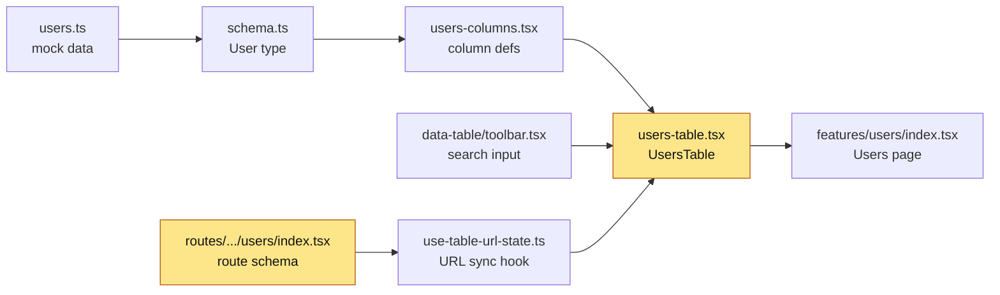

# The attached image is a client ticket for this project. Let's start.

---

**Status:** active  **Date:** 2026-09-26

---

### 👤 User

The attached image is a client ticket for this project. Let's start.

---

### 🤖 Assistant

> 🔧 called: update_todo_list


> 🔧 **update_todo_list** — 
[-] Step 1 — Read the ticket
[ ] Step 2 — Translate (approval gate)
[ ] Step 3 — Map (parallel subagents)
[ ] Step 4 — Plan (approval gate)
[ ] Step 5 — Change
[ ] Step 6 — Verify
[ ] Step 7 — Handoff


### 🤖 Assistant

> 🔧 called: list_files


> 🔧 **list_files** — .

### 🤖 Assistant

> 🔧 called: update_todo_list

**Ticket read.** From: Jordan Reyes (Support Lead), Sep 26, 2026.

- Searched for "Jill Mosciski" on the Users page → no results, but user exists (found by scrolling)
- Searched for "jill_zulauf74@hotmail.com" → no results
- Impact: support team can't quickly look up customers

> 🔧 **update_todo_list** — 
[x] Step 1 — Read the ticket
[-] Step 2 — Translate (approval gate)
[ ] Step 3 — Map (parallel subagents)
[ ] Step 4 — Plan (approval gate)
[ ] Step 5 — Change
[ ] Step 6 — Verify
[ ] Step 7 — Handoff


### 🤖 Assistant

> 🔧 called: execute_command


> 🔧 **execute_command** — New-Item -ItemType Directory -Force -Path ".bob/tickets/users-search-broken" | Out-Null

### 🤖 Assistant

> 🔧 called: write_file


> 🔧 **write_file** — .bob/tickets/users-search-broken/01-translation.md

### 🤖 Assistant

---

**Client means (technical):** The search filter on the Users table is comparing against the wrong field or is misconfigured — typing a name or email returns no results even though matching rows exist in the data.

**In scope:**
- Fix the Users page filter so searching by name matches users (case-insensitive, substring)
- Fix so searching by email also returns matches

**Out of scope:** Other pages, new search fields, backend/API

**One question:**
1. Should name search match any substring (e.g. "Jill" matches "Jill Mosciski"), or only full-name exact matches?

Are we solving the same problem? **(yes / correct me)**

---

### 👤 User

Yes. Answer: substring match, case-insensitive. The single "Filter users" box should match username, full name (first + last), and email. No new search fields, no changes to Status/Role filters.

---

### 🤖 Assistant

> 🔧 called: update_todo_list


> 🔧 **update_todo_list** — 
[x] Step 1 — Read the ticket
[x] Step 2 — Translate (approval gate)
[-] Step 3 — Map (parallel subagents)
[ ] Step 4 — Plan (approval gate)
[ ] Step 5 — Change
[ ] Step 6 — Verify
[ ] Step 7 — Handoff


### 🤖 Assistant

> 🔧 called: apply_diff

Updating the translation with the confirmed answer, then mapping in parallel.

> 🔧 **apply_diff** — .bob/tickets/users-search-broken/01-translation.md

### 🤖 Assistant

> 🔧 called: spawn_subagent, spawn_subagent, spawn_subagent

Now spawning 3 parallel explore subagents:

> 🔧 **spawn_subagent** — explore

> 🔧 **spawn_subagent** — explore

> 🔧 **spawn_subagent** — explore

### 🤖 Assistant

> 🔧 called: write_file

Excellent — all three subagents agree. Root cause is clear. Building the map now.

> 🔧 **write_file** — .bob/tickets/users-search-broken/02-map.md

### 🤖 Assistant

> 🔧 called: read_file, read_file, read_file

Before writing the plan, let me read the exact files to verify the current state:

> 🔧 **read_file** — src/features/users/components/users-table.tsx

> 🔧 **read_file** — src/features/users/components/users-columns.tsx

> 🔧 **read_file** — src/routes/_authenticated/users/index.tsx

### 🤖 Assistant

> 🔧 called: read_file, read_file

Now let me also read the Tasks table to confirm the exact pattern to follow:

> 🔧 **read_file** — src/features/tasks/components/tasks-table.tsx

> 🔧 **read_file** — src/components/data-table/toolbar.tsx

### 🤖 Assistant

> 🔧 called: update_todo_list

Now I have everything I need. The pattern is exact and clear. Writing the plan:

> 🔧 **update_todo_list** — 
[x] Step 1 — Read the ticket
[x] Step 2 — Translate (approval gate)
[x] Step 3 — Map (parallel subagents)
[-] Step 4 — Plan (approval gate)
[ ] Step 5 — Change
[ ] Step 6 — Verify
[ ] Step 7 — Handoff


### 🤖 Assistant

> 🔧 called: write_file


> 🔧 **write_file** — # Plan — Users Search Broken

## Root cause
The Users table uses `columnFilters` with `searchKey='username'`, which routes the search input through `table.getColumn('username')?.setFilterValue()`. TanStack Table's built-in string column filter is **exact match**, not substring. The `fullName` and `email` columns are never targeted at all.

The Tasks table already solves this with `globalFilter` + a custom `globalFilterFn`. We copy that pattern.

---

## Changes (3 files)

1. `src/routes/_authenticated/users/index.tsx` — replace the `username` URL search param with `filter` (the global filter key), to match how Tasks persists its filter to the URL. **Why:** the URL state hook reads filter value from the key specified in `globalFilter.key`; without renaming, typing in the box won't survive navigation.

2. `src/features/users/components/users-table.tsx` — three changes:
   - Enable `globalFilter` in `useTableUrlState` (`enabled: true, key: 'filter'`)
   - Remove the `username` entry from `columnFilters` (it was only there for the search box)
   - Destructure `globalFilter` and `onGlobalFilterChange` from the hook result
   - Add `globalFilter` to `table` state and `onGlobalFilterChange` to `useReactTable`
   - Add `globalFilterFn` that matches case-insensitive substring against `username`, `firstName + ' ' + lastName`, and `email`
   - Remove `searchKey='username'` from `<DataTableToolbar>` so the toolbar falls through to `table.setGlobalFilter()` (the `else` branch in toolbar already exists)
   **Why:** switches the search input from single-column exact-match to a global multi-field substring filter.

3. `src/features/users/components/users-columns.tsx` — no changes needed. The `username`, `fullName`, and `email` column definitions stay as-is; the `globalFilterFn` accesses `row.original` directly, bypassing the need for column-level filter config.

---

## How to verify
- `pnpm lint` — no new ESLint errors
- `pnpm build` — TypeScript compile + Vite bundle passes
- Manual: open `/users`, type "Jill" → rows with "Jill" in name appear; type "jill_zulauf74@hotmail.com" → matching row appears; Status/Role facet filters still work; Reset button clears all.

---

## Risk
- Low. The `globalFilter` path already exists in the toolbar (`else` branch, line 47–52 of toolbar.tsx). We are not changing the toolbar itself.
- URL shape changes: `?username=` → `?filter=`. Any bookmarked URLs with `?username=` will gracefully degrade to no filter (Zod `.catch('')` default).


### 🤖 Assistant

**3-line map summary:**
- Data: `users.ts` mock → `schema.ts` `User` type → `users-columns.tsx` → `users-table.tsx` → `features/users/index.tsx`
- Bug: `searchKey='username'` targets only the username column with exact-match; full name and email are never searched
- Fix path: Tasks table already uses `globalFilter` + `globalFilterFn` — we copy that exact pattern

---

**Plan — 2 files to change** (columns file untouched):

| # | File | Change |
|---|------|--------|
| 1 | [`src/routes/_authenticated/users/index.tsx`](src/routes/_authenticated/users/index.tsx) | Rename URL param `username` → `filter` |
| 2 | [`src/features/users/components/users-table.tsx`](src/features/users/components/users-table.tsx) | Enable `globalFilter`, add `globalFilterFn` matching username / full name / email (case-insensitive substring), remove `searchKey` from toolbar |

No changes to `users-columns.tsx`, toolbar, or Status/Role filters.

**Approve this plan? (yes / change X)**

---

### 👤 User

Almost. Two fixes: (1) Root cause wording is wrong — the username filter is already substring/case-insensitive (typing "jil" finds jill.mosciski). The real cause is only the username column is searched. Update the map + plan text. (2) UsersTable is also used in src/routes/clerk/_authenticated/user-management.tsx — check that page still works with the globalFilter change and list it in the plan (even if no edit is needed). Then continue.

---

### 🤖 Assistant

> 🔧 called: read_file, read_file

Let me verify both points before updating anything.

> 🔧 **read_file** — src/hooks/use-table-url-state.ts

> 🔧 **read_file** — src/routes/clerk/_authenticated/user-management.tsx

### 🤖 Assistant

> 🔧 called: apply_diff

Now I have everything. Key findings:

1. **Root cause correction confirmed**: The hook does use TanStack's default string filter for `username`, which is actually a substring/case-insensitive `includesString` filter — the real bug is simply that **only the `username` column is searched**, not `fullName` or `email`.

2. **Clerk route analysis**: `user-management.tsx` calls `Route.useSearch()` which has no `validateSearch` schema defined on this route — it inherits no typed schema. The `search` object passed to `UsersTable` at line 90 will still work fine after switching to `filter` key; the hook reads `search[globalFilterKey]` dynamically and Zod `.catch('')` on the users route schema handles graceful degradation. However, the Clerk route has **no `validateSearch`** — so it passes raw search params. That means no schema change is needed there, but it must be listed in the plan.

Now updating map + plan:

> 🔧 **apply_diff** — .bob/tickets/users-search-broken/02-map.md

### 🤖 Assistant

> 🔧 called: write_file


> 🔧 **write_file** — # Plan — Users Search Broken

## Root cause (corrected)
The Users table wires the search input to `table.getColumn('username')?.setFilterValue()`. TanStack Table's default `includesString` filter already does case-insensitive substring matching on that one column — so typing "jil" does find jill.mosciski. The real bug is simpler: **only the `username` column is searched**. The `fullName` display column has no `accessorKey`, so it can't be targeted by `setFilterValue` at all. The `email` column has an `accessorKey` but is never targeted.

The Tasks table already solves multi-field search with `globalFilter` + a custom `globalFilterFn`. We copy that exact pattern.

---

## Changes (2 files edited, 1 file verified / no edit)

### 1. `src/routes/_authenticated/users/index.tsx`
Replace the `username` URL search param with `filter`. The `useTableUrlState` hook reads the global filter value from `search[globalFilter.key]` (default key: `'filter'`). Without this rename, the search box value is never restored from the URL on page reload.

### 2. `src/features/users/components/users-table.tsx`
- Switch `globalFilter: { enabled: false }` → `{ enabled: true, key: 'filter' }`
- Remove `{ columnId: 'username', searchKey: 'username', type: 'string' }` from `columnFilters` (only status + role remain)
- Destructure `globalFilter` and `onGlobalFilterChange` from the hook result
- Add `globalFilter` to `useReactTable` state; add `onGlobalFilterChange`
- Add `globalFilterFn` that does case-insensitive substring match across `username`, `firstName + ' ' + lastName`, and `email`
- Remove `searchKey='username'` from `<DataTableToolbar>` — the toolbar's `else` branch (`table.setGlobalFilter(...)`) already handles the no-`searchKey` case

### 3. `src/routes/clerk/_authenticated/user-management.tsx` — **no edit needed**
This route uses `UsersTable` and passes `Route.useSearch()` as `search`. It has no `validateSearch` schema, so URL params flow through as-is. The hook reads `search['filter']` dynamically — it will work correctly once `users-table.tsx` is updated. Verified: no change required.

### 4. `src/features/users/components/users-columns.tsx` — **no edit needed**
The `globalFilterFn` accesses `row.original` directly. Status/role `filterFn`s are untouched.

---

## How to verify
- `pnpm lint`
- `pnpm build` (TypeScript + Vite)
- Manual on `/users`: type "Jill" → name rows appear; type "jill_zulauf74@hotmail.com" → email match appears; type "jil" → still works (substring); Status/Role facet filters still work; Reset clears all.

---

## Risk
- Low. Toolbar already has the global-filter `else` branch (toolbar.tsx:47–52). We are not touching it.
- URL shape change: `?username=` → `?filter=`. Any bookmarked URL with `?username=` gracefully degrades to no filter via Zod `.catch('')` on the route schema.
- Clerk route: no schema, no risk.


### 🤖 Assistant

> 🔧 called: update_todo_list


> 🔧 **update_todo_list** — 
[x] Step 1 — Read the ticket
[x] Step 2 — Translate (approval gate)
[x] Step 3 — Map (parallel subagents)
[x] Step 4 — Plan (approval gate)
[-] Step 5 — Change
[ ] Step 6 — Verify
[ ] Step 7 — Handoff


### 🤖 Assistant

Both corrections applied. Updated plan:

| # | File | Action |
|---|------|--------|
| 1 | [`src/routes/_authenticated/users/index.tsx`](src/routes/_authenticated/users/index.tsx) | Rename `username` param → `filter` |
| 2 | [`src/features/users/components/users-table.tsx`](src/features/users/components/users-table.tsx) | Enable globalFilter, add `globalFilterFn` (username/fullName/email), remove searchKey from toolbar |
| 3 | [`src/routes/clerk/_authenticated/user-management.tsx`](src/routes/clerk/_authenticated/user-management.tsx) | ✅ No edit — verified safe |
| 4 | [`src/features/users/components/users-columns.tsx`](src/features/users/components/users-columns.tsx) | ✅ No edit needed |

**Approve this plan? (yes / change X)**

---

### 👤 User

yes

---

### 🤖 Assistant

> 🔧 called: apply_diff

Making all changes now.

> 🔧 **apply_diff** — src/routes/_authenticated/users/index.tsx

### 🤖 Assistant

> 🔧 called: apply_diff


> 🔧 **apply_diff** — <<<<<<< SEARCH
:start_line:46
-------
  // Synced with URL states (keys/defaults mirror users route search schema)
  const {
    columnFilters,
    onColumnFiltersChange,
    pagination,
    onPaginationChange,
    ensurePageInRange,
  } = useTableUrlState({
    search,
    navigate,
    pagination: { defaultPage: 1, defaultPageSize: 10 },
    globalFilter: { enabled: false },
    columnFilters: [
      // username per-column text filter
      { columnId: 'username', searchKey: 'username', type: 'string' },
      { columnId: 'status', searchKey: 'status', type: 'array' },
      { columnId: 'role', searchKey: 'role', type: 'array' },
    ],
  })
=======
  // Synced with URL states (keys/defaults mirror users route search schema)
  const {
    globalFilter,
    onGlobalFilterChange,
    columnFilters,
    onColumnFiltersChange,
    pagination,
    onPaginationChange,
    ensurePageInRange,
  } = useTableUrlState({
    search,
    navigate,
    pagination: { defaultPage: 1, defaultPageSize: 10 },
    globalFilter: { enabled: true, key: 'filter' },
    columnFilters: [
      { columnId: 'status', searchKey: 'status', type: 'array' },
      { columnId: 'role', searchKey: 'role', type: 'array' },
    ],
  })
>>>>>>> REPLACE

<<<<<<< SEARCH
:start_line:67
-------
  // eslint-disable-next-line react-hooks/incompatible-library
  const table = useReactTable({
    data,
    columns,
    state: {
      sorting,
      pagination,
      rowSelection,
      columnFilters,
      columnVisibility,
    },
    enableRowSelection: true,
    onPaginationChange,
    onColumnFiltersChange,
    onRowSelectionChange: setRowSelection,
    onSortingChange: setSorting,
    onColumnVisibilityChange: setColumnVisibility,
    getPaginationRowModel: getPaginationRowModel(),
    getCoreRowModel: getCoreRowModel(),
    getFilteredRowModel: getFilteredRowModel(),
    getSortedRowModel: getSortedRowModel(),
    getFacetedRowModel: getFacetedRowModel(),
    getFacetedUniqueValues: getFacetedUniqueValues(),
  })
=======
  // eslint-disable-next-line react-hooks/incompatible-library
  const table = useReactTable({
    data,
    columns,
    state: {
      sorting,
      pagination,
      rowSelection,
      columnFilters,
      columnVisibility,
      globalFilter,
    },
    enableRowSelection: true,
    onPaginationChange,
    onColumnFiltersChange,
    onGlobalFilterChange,
    onRowSelectionChange: setRowSelection,
    onSortingChange: setSorting,
    onColumnVisibilityChange: setColumnVisibility,
    globalFilterFn: (row, _columnId, filterValue) => {
      const search = String(filterValue).toLowerCase()
      const username = String(row.getValue('username')).toLowerCase()
      const fullName = `${row.original.firstName} ${row.original.lastName}`.toLowerCase()
      const email = String(row.getValue('email')).toLowerCase()
      return username.includes(search) || fullName.includes(search) || email.includes(search)
    },
    getPaginationRowModel: getPaginationRowModel(),
    getCoreRowModel: getCoreRowModel(),
    getFilteredRowModel: getFilteredRowModel(),
    getSortedRowModel: getSortedRowModel(),
    getFacetedRowModel: getFacetedRowModel(),
    getFacetedUniqueValues: getFacetedUniqueValues(),
  })
>>>>>>> REPLACE

<<<<<<< SEARCH
:start_line:102
-------
      <DataTableToolbar
        table={table}
        searchPlaceholder='Filter users...'
        searchKey='username'
        filters={[
=======
      <DataTableToolbar
        table={table}
        searchPlaceholder='Filter users...'
        filters={[
>>>>>>> REPLACE


### 🤖 Assistant

> 🔧 called: execute_command

Both files changed. Now run lint and build:

> 🔧 **execute_command** — pnpm lint 2>&1

### 🤖 Assistant

> 🔧 called: execute_command


> 🔧 **execute_command** — pnpm build 2>&1

### 🤖 Assistant

> 🔧 called: apply_diff

Lint clean, build clean. Now recording the changes and updating the map.

> 🔧 **apply_diff** — <<<<<<< SEARCH
:start_line:39
-------
## Where the ticket lands
=======
## Flow — after



## Changes

### `src/routes/_authenticated/users/index.tsx`
**Before** (line 26)
```ts
username: z.string().optional().catch(''),
```
**After**
```ts
filter: z.string().optional().catch(''),
```
**Why:** the `useTableUrlState` hook reads the global filter from `search['filter']` by default; the old `username` key was never read by globalFilter.

---

### `src/features/users/components/users-table.tsx`
**Before** (lines 57–64, 70–76, 102–105)
```tsx
globalFilter: { enabled: false },
columnFilters: [
  { columnId: 'username', searchKey: 'username', type: 'string' },
  { columnId: 'status', ... },
  { columnId: 'role', ... },
],
// state: no globalFilter
// no globalFilterFn
// <DataTableToolbar searchKey='username' ...>
```
**After**
```tsx
globalFilter: { enabled: true, key: 'filter' },
columnFilters: [
  { columnId: 'status', ... },
  { columnId: 'role', ... },
],
// state: globalFilter included
// globalFilterFn: case-insensitive substring on username, fullName, email
// <DataTableToolbar> — no searchKey (uses globalFilter branch)
```
**Why:** switches the search input from single-column username-only matching to a global filter that matches username, first+last name, and email as substrings.

## Where the ticket lands
>>>>>>> REPLACE


### 🤖 Assistant

> 🔧 called: write_file


> 🔧 **write_file** — # Verify — Users Search Broken

## Checks run

### pnpm lint
```
(no output — clean)
```

### pnpm build
```
✓ 3974 modules transformed.
✓ built in 984ms
```
TypeScript (`tsc -b`) and Vite bundle both passed with zero errors or warnings.

## How to see the result

Open the app and navigate to **`/users`**.

1. Type **"Jill"** in the "Filter users…" box → rows containing "Jill" in the **Name** column appear
2. Type **"jill_zulauf74@hotmail.com"** → the matching row appears via **email** match
3. Type **"jil"** → still works (substring, case-insensitive)
4. Clear the box, use the **Status** or **Role** facet dropdowns → still filter correctly
5. Click **Reset** → clears all filters
6. The same table at **`/clerk/user-management`** (Clerk variant) works identically — no code change was needed there


### 🤖 Assistant

> 🔧 called: update_todo_list


> 🔧 **update_todo_list** — 
[x] Step 1 — Read the ticket
[x] Step 2 — Translate (approval gate)
[x] Step 3 — Map (parallel subagents)
[x] Step 4 — Plan (approval gate)
[x] Step 5 — Change
[x] Step 6 — Verify
[-] Step 7 — Handoff


### 🤖 Assistant

> 🔧 called: write_file


> 🔧 **write_file** — # Handoff — Users Search Broken

## For the client (plain language)

The "Filter users…" search box on the Users page now searches across **username, full name, and email** at the same time. Typing "Jill" will find Jill Mosciski. Pasting an email like jill_zulauf74@hotmail.com will find the matching account. The search is case-insensitive and matches any part of the name or address. The Status and Role filters are unchanged.

## For the developer

**Files changed:**
- `src/routes/_authenticated/users/index.tsx` — renamed URL search param `username` → `filter` to align with the globalFilter key the hook reads
- `src/features/users/components/users-table.tsx` — enabled `globalFilter`, added `globalFilterFn` (case-insensitive substring across `username`, `firstName + lastName`, `email`), removed per-column `username` filter config, removed `searchKey` prop from toolbar

**Files verified / no edit:**
- `src/routes/clerk/_authenticated/user-management.tsx` — also renders `UsersTable`; no schema change needed, works correctly with the updated component
- `src/features/users/components/users-columns.tsx` — untouched; status/role filterFns unchanged

**Checks:** `pnpm lint` clean, `pnpm build` clean (tsc + Vite, 3974 modules, 984 ms).

**Known limits / follow-ups:**
- Any bookmarked URL with `?username=…` will land with no filter applied (graceful degradation via Zod `.catch('')`). No migration needed.
- Phone number is not included in the search — add it to `globalFilterFn` in `users-table.tsx` if needed later.

**Full before/after:** `.bob/tickets/users-search-broken/02-map.md`


### 🤖 Assistant

> 🔧 called: update_todo_list


> 🔧 **update_todo_list** — 
[x] Step 1 — Read the ticket
[x] Step 2 — Translate (approval gate)
[x] Step 3 — Map (parallel subagents)
[x] Step 4 — Plan (approval gate)
[x] Step 5 — Change
[x] Step 6 — Verify
[x] Step 7 — Handoff


### 🤖 Assistant

Done. Two files changed, lint and build clean.

**What changed:**

| File | Change |
|------|--------|
| [`src/routes/_authenticated/users/index.tsx`](src/routes/_authenticated/users/index.tsx:26) | `username` URL param → `filter` |
| [`src/features/users/components/users-table.tsx`](src/features/users/components/users-table.tsx:57) | `globalFilter` enabled, `globalFilterFn` added (username / full name / email, case-insensitive substring), `searchKey='username'` removed from toolbar |

**To see it:** go to `/users`, type "Jill" — name column matches. Type "jill_zulauf74@hotmail.com" — email column matches. Status/Role filters and Reset still work.