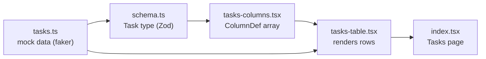
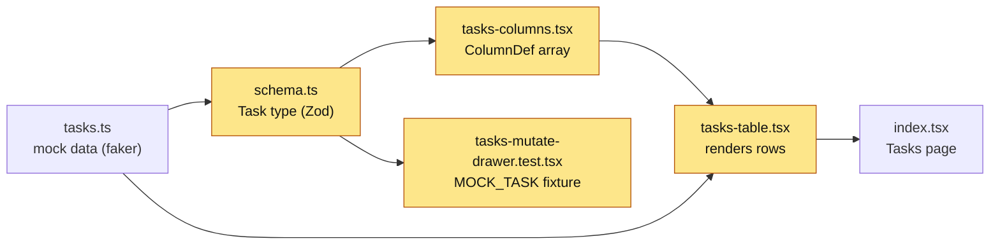

# Map — Tasks page: due dates & assignee

## How it works (plain words)
Mock task data is generated in `tasks.ts` using `faker` and imported directly
into the Tasks page — there is no API call. The `Task` TypeScript type is derived
from a Zod schema in `schema.ts`; the schema is the source of truth for what
fields the table can read. Column definitions live in `tasks-columns.tsx` (a
TanStack Table `ColumnDef<Task>[]` array); TanStack Table column definitions
describe how each field is rendered in a header and cell. The `TasksTable`
component in `tasks-table.tsx` wires the data + columns into `useReactTable` and
renders `<TableRow>` / `<TableCell>` from shadcn/ui. The Tasks route at
`src/routes/_authenticated/tasks/index.tsx` renders the page and passes the
mock data down.

Key gap: `schema.ts` does **not** include `assignee` or `dueDate` even though
`tasks.ts` already generates both fields. The Zod schema must be extended so
`Task` exposes those fields to the columns.

## Flow


## Evidence
| From | To | Proof (path:line) |
|---|---|---|
| tasks.ts | schema.ts | `src/features/tasks/data/tasks.ts:25,27` — generates `assignee` & `dueDate` |
| schema.ts | cols | `src/features/tasks/components/tasks-columns.tsx:6` — `import { type Task } from '../data/schema'` |
| cols | table | `src/features/tasks/components/tasks-table.tsx:29` — `import { tasksColumns as columns }` |
| tasks | page | `src/features/tasks/index.tsx:11` — `import { tasks } from './data/tasks'` |
| table | page | `src/features/tasks/index.tsx:33` — `<TasksTable data={tasks} />` |

## Where the ticket lands
- `src/features/tasks/data/schema.ts` — must add `assignee: z.string()` and `dueDate: z.date()` so `Task` exposes both fields
- `src/features/tasks/components/tasks-columns.tsx` — add Assignee and Due Date column definitions
- `src/features/tasks/components/tasks-table.tsx` — add conditional `className` to `<TableRow>` for the 0–30 day highlight

## Conventions found
- Badge pattern (tasks-columns.tsx:57): `<Badge variant='outline'>{label.label}</Badge>` inside cell render
- `cn()` used everywhere for conditional classNames (`tasks-table.tsx:15` import, `tasks-table.tsx:109`)
- Row data accessed via `row.original` (tasks-columns.tsx:53: `row.original.label`)
- `date-fns` is already in dependencies — use `isAfter`, `isBefore`, `addDays`, `startOfDay`
- Package manager: **pnpm**
- Build/check commands: `pnpm build` (runs `tsc -b && vite build`), `pnpm lint` (eslint)

## Flow — after



## Changes

### `src/features/tasks/data/schema.ts`
**Before** (lines 5–11)
```ts
export const taskSchema = z.object({
  id: z.string(),
  title: z.string(),
  status: z.string(),
  label: z.string(),
  priority: z.string(),
})
```
**After**
```ts
export const taskSchema = z.object({
  id: z.string(),
  title: z.string(),
  status: z.string(),
  label: z.string(),
  priority: z.string(),
  assignee: z.string(),
  dueDate: z.date(),
})
```
**Why:** Exposes `assignee` and `dueDate` (already in mock data) to the `Task` type so columns can access them.

---

### `src/features/tasks/components/tasks-columns.tsx`
**Before** (line 119)
```tsx
  {
    id: 'actions',
    cell: ({ row }) => <DataTableRowActions row={row} />,
  },
```
**After**
```tsx
  {
    accessorKey: 'assignee',
    header: ({ column }) => (
      <DataTableColumnHeader column={column} title='Assignee' />
    ),
    cell: ({ row }) => <div>{row.original.assignee}</div>,
  },
  {
    accessorKey: 'dueDate',
    header: ({ column }) => (
      <DataTableColumnHeader column={column} title='Due Date' />
    ),
    cell: ({ row }) => (
      <div>{format(row.original.dueDate, 'MMM d, yyyy')}</div>
    ),
  },
  {
    id: 'actions',
    cell: ({ row }) => <DataTableRowActions row={row} />,
  },
```
**Why:** Adds Assignee and Due Date columns before the actions column.

---

### `src/features/tasks/components/tasks-table.tsx`
**Before** (line 160)
```tsx
<TableRow
  key={row.id}
  data-state={row.getIsSelected() && 'selected'}
>
```
**After**
```tsx
<TableRow
  key={row.id}
  data-state={row.getIsSelected() && 'selected'}
  className={cn({
    'bg-amber-50 dark:bg-amber-950/20': (() => {
      const due = row.original.dueDate
      const today = startOfDay(new Date())
      const limit = addDays(today, 30)
      return !isBefore(due, today) && !isAfter(due, limit)
    })(),
  })}
>
```
**Why:** Applies amber row highlight when `today ≤ dueDate ≤ today+30 days`; overdue rows are excluded by the `!isBefore(due, today)` guard.

---

### `src/features/tasks/components/tasks-mutate-drawer.test.tsx`
**Before** (lines 11–17)
```ts
const MOCK_TASK = {
  id: 'task-1',
  title: 'Existing task',
  status: 'in progress',
  label: 'feature',
  priority: 'medium',
} as const satisfies Task
```
**After**
```ts
const MOCK_TASK = {
  id: 'task-1',
  title: 'Existing task',
  status: 'in progress',
  label: 'feature',
  priority: 'medium',
  assignee: 'Jane Doe',
  dueDate: new Date('2099-01-01'),
} satisfies Task
```
**Why:** Schema now requires `assignee` and `dueDate`; fixture must include them to satisfy the type. `as const` dropped because `new Date()` is not a literal type.
