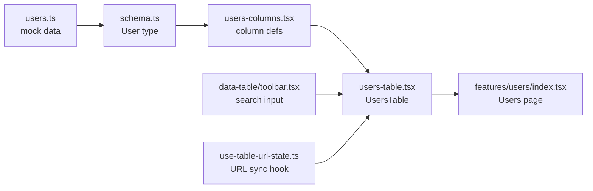
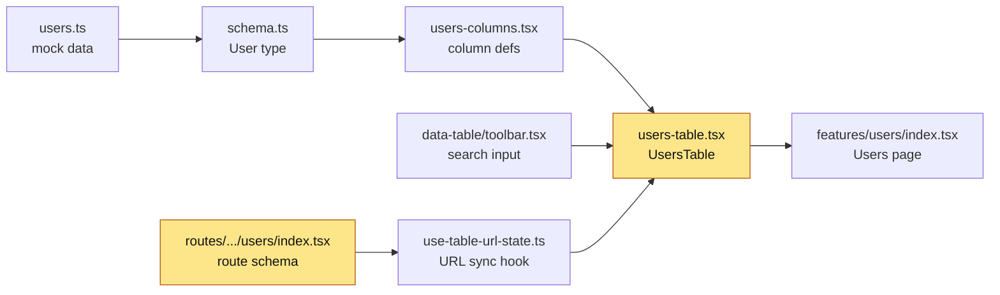

# Map — Users Search Broken

## How it works (plain words)

User records are generated from faker mock data in `users.ts` and typed via a Zod schema in `schema.ts`. The Users page (`features/users/index.tsx`) passes this data to `UsersTable`, which uses **TanStack Table** (a headless table library where you provide column definitions and filter functions). Column definitions live in `users-columns.tsx`.

The search box in the toolbar calls `table.getColumn(searchKey)?.setFilterValue(value)` — it targets a **single named column** (`username`). TanStack Table's built-in `includesString` filter (the default for string columns) already does case-insensitive substring matching, so typing "jil" does find jill.mosciski. The real bug is that **only the `username` column is searched**: `fullName` has no `accessorKey` so it cannot be targeted by `setFilterValue`, and `email` is never targeted either.

The fix is to switch Users from the column-filter approach to the **globalFilter** approach (already used by the Tasks table), with a custom `globalFilterFn` that does a case-insensitive substring match across `username`, `firstName`, `lastName` (combined as full name), and `email`.

## Flow



## Evidence

| From | To | Proof (path:line) |
|---|---|---|
| users.ts | schema.ts | `src/features/users/data/users.ts:6` imports `User` from schema |
| schema.ts | users-columns.tsx | `src/features/users/components/users-columns.tsx:1` imports schema types |
| users-columns.tsx | users-table.tsx | `src/features/users/components/users-table.tsx` imports columns |
| users-table.tsx | features/users/index.tsx | `src/features/users/index.tsx:39` renders `<UsersTable>` |
| toolbar.tsx | users-table.tsx | `src/features/users/components/users-table.tsx:102-105` passes `searchKey='username'` to `DataTableToolbar` |
| use-table-url-state.ts | users-table.tsx | `src/features/users/components/users-table.tsx:58-63` calls hook with columnFilters config |

## Flow — after



## Changes

### `src/routes/_authenticated/users/index.tsx`
**Before** (line 26)
```ts
username: z.string().optional().catch(''),
```
**After**
```ts
filter: z.string().optional().catch(''),
```
**Why:** the `useTableUrlState` hook reads the global filter from `search['filter']` by default; the old `username` key was never read by globalFilter.

---

### `src/features/users/components/users-table.tsx`
**Before** (lines 57–64, 70–76, 102–105)
```tsx
globalFilter: { enabled: false },
columnFilters: [
  { columnId: 'username', searchKey: 'username', type: 'string' },
  { columnId: 'status', ... },
  { columnId: 'role', ... },
],
// state: no globalFilter
// no globalFilterFn
// <DataTableToolbar searchKey='username' ...>
```
**After**
```tsx
globalFilter: { enabled: true, key: 'filter' },
columnFilters: [
  { columnId: 'status', ... },
  { columnId: 'role', ... },
],
// state: globalFilter included
// globalFilterFn: case-insensitive substring on username, fullName, email
// <DataTableToolbar> — no searchKey (uses globalFilter branch)
```
**Why:** switches the search input from single-column username-only matching to a global filter that matches username, first+last name, and email as substrings.

## Where the ticket lands

- `src/features/users/components/users-table.tsx` — switch globalFilter from `{ enabled: false }` to `{ enabled: true }`, add `globalFilterFn` matching username/fullName/email, remove `username` from columnFilters search config
- `src/features/users/components/users-columns.tsx` — no changes needed; status/role filterFns untouched
- `src/routes/_authenticated/users/index.tsx` — rename URL param `username` → `filter` (to match the globalFilter key the hook reads)
- `src/routes/clerk/_authenticated/user-management.tsx` — no edit needed; passes `search` directly to `UsersTable`, no validateSearch schema, so the `filter` key in the URL is read correctly by the hook already
